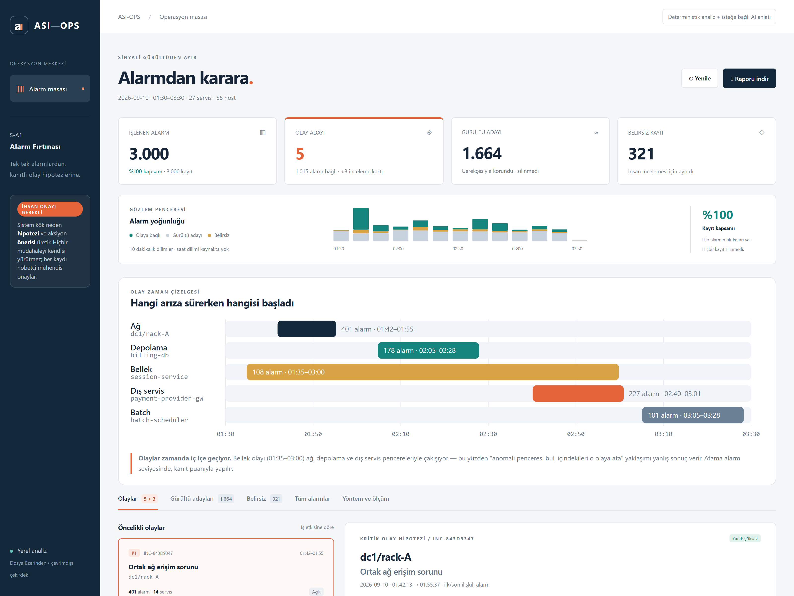

# asi-ops

## Proje Adı ve Özet

**ASI-OPS — Alarmdan karara.** Alarm fırtınasını kanıtları incelenebilen olay hipotezlerine ve sorumlusu belirlenmiş ilk aksiyonlara dönüştüren yerel operasyon masası.

## Çözdüğümüz Problem

S-A1 paketindeki 3.000 alarm aynı anda birden fazla soruna işaret ediyor. Yalnız zaman veya servis bazında gruplama, oturum ve ödeme sorunlarını aynı karta karıştırabilir. Operatörün bağlantıyı, belirsizliği ve ilk aksiyonu birlikte görebilmesi gerekir.

## Çözümümüzün Nasıl Çalıştığı

1. Bütün kayıtları, envanteri ve yönlü bağımlılıkları doğrular.
2. Kök alarm imzalarını ve host bazında artan bellek serilerini bulur.
3. Her alarmı zaman, servis, mesaj hedefi, grafik yolu ve fiziksel hata alanıyla puanlar.
4. Olay / gürültü adayı / belirsiz kararını gerekçesiyle saklar.
5. Belirsizlerdeki tekrarlayan kümeleri düşük kanıtlı inceleme kartlarında gösterir.
6. Düzenlenebilir sorumlu rolü, durum, not geçmişi ve JSON dışa aktarımı sunar.

Katılımcı verisinde **5 olay + 3 inceleme kartı**; **1.015 olaya bağlı + 1.664 gürültü adayı + 321 belirsiz = 3.000 alarm**. İnceleme kartlarındaki 84 kayıt belirsiz toplamının içindedir. Bunlar doğruluk/recall ölçümü değildir. Detay: [geliştirme raporu](docs/gelistirme_raporu.md), [mimari](docs/mimari.md).

## Kurulum Adımları

Python **3.9 veya üstü** yeterli. Paket kurulumu, Node, veritabanı veya API anahtarı gerekmez.

```bash
git clone https://github.com/GUCYENER/asi-ops.git
cd asi-ops
```

Katılımcı paketini `data/katilimci_paketi/` altına yerleştirin (orijinal dosyalar repoya konmadı). Farklı bir konum kullanacaksanız `--data-dir` ile gösterin. `alarms.json` **veya** `alarms.csv`, `host_inventory.csv`, `service_dependencies.csv` gerekir. İkisi de varsa JSON seçilir; ikisi birlikte sayılmaz.

`.env` bu çalışma alanında boş anahtarlarla hazır. Başka makinede isteğe bağlı olarak `.env.example` dosyasını `.env` olarak kopyalayın. Çekirdek için zorunlu değildir.

## Çalıştırma Komutu

```bash
python run.py
```

Tarayıcı: **http://127.0.0.1:8000**. (Eşdeğeri: `python app.py --data-dir data/katilimci_paketi`) Port doluysa `--port 8002` ekleyin. Varsayılan veri konumu proje klasörünün kardeşi `katilimci_paketi` dizinidir.

Sunucusuz yedek çıktı:

```bash
python app.py --data-dir data/katilimci_paketi --export outputs/report.json
```

Testler:

```bash
python -m pytest tests -q
```

Sentetik örnekler, gerçek veri regresyonları, JSON/CSV eşdeğerliği, zaman/kimlik/servis değişiklikleri, HTTP uçları, aksiyonlar ve LLM fallback'i kapsanır. Katılımcı paketi yoksa ona bağlı testler açıkça atlanır. Test sonuçları: [doğrulama](docs/dogrulama.md).

## Kullanılan AI Araçları ve Model Sürümleri

| Araç | Model / Sürüm | Kullanım Amacı |
|---|---|---|
| Codex | GPT-6; daha ayrıntılı build kimliği sağlanmadı | Analiz, kod, test ve dokümantasyon üretimi |
| Claude Code | `claude-opus-5` | Bütünleşik analiz, B3 geçmiş olay eşleştirme, entegrasyon ve doğrulama |
| Azure Anthropic Messages | `claude-sonnet-4-5-20250929` | Kanıtların kısa anlatısı; **canlı erişim doğrulandı**, kanıt kimlikleri şema kontrolünden geçiyor |

Kararları LLM vermez. Eğitilmiş ML modeli veya ölçülmüş doğruluk iddiası yok. İnsan kapsamı ve bütünleşik analizi onayladı; kod ve sonuçlar incelemeye açık.

## MCP Sunucu Listesi

Ürün çalışma zamanında MCP sunucusu kullanmaz. Geliştirmede yerel dosya/komut araçları ve resmi API dokümanı araması kullanıldı; harici ekip hesabına erişilmedi.

## Entegre Edilen API'ler

- Yerel HTTP JSON API: [sözleşme](docs/sozlesme.md).
- Azure Anthropic Messages: `.env` içine `AZURE_ANTHROPIC_ENDPOINT`, `AZURE_ANTHROPIC_API_KEY` yazıp `LLM_ENABLED=true` yapılır. İstek yalnız "AI ile kısa özet" düğmesiyle gider. Sekiz saniye timeout, kanıt kimliği doğrulaması ve hata halinde şablon geri dönüşü var. **Bu kurulumda canlı çağrı doğrulandı.**
- Entegrasyon biçimi [Microsoft'un resmi Claude/Foundry belgesine](https://learn.microsoft.com/en-us/azure/foundry/foundry-models/how-to/use-foundry-models-claude) dayanır. Canlı sağlayıcı çağrısı bu kurulumda test edildi ve çalışıyor.

## Ekran Görüntüleri

Çalışan uygulamadan alınmıştır:



[Alarm izlenebilirliği](demo/alarm-izlenebilirligi.png) · [Yöntem ve ölçüm](demo/yontem-ve-olcum.png) · [Mobil görünüm](demo/mobil.png).

## Deploy URL ve Bilinen Sınırlar

- **Deploy URL:** Yok; yerel `127.0.0.1` uygulaması (organizatör deploy'u zorunlu tutmuyor).
- Altın etiketler kapalı; kök doğruluğu ve gürültü isabeti bilinmiyor. Eşikler açık heuristiklerdir.
- İnceleme kartları yeni bağımsız olay kanıtı değildir; kayıtlar belirsiz kalır.
- Aksiyonlar bellekte tutulur. Yeniden başlatmadan önce raporu indirin; dışa aktarımı geri yükleme özelliği yok.
- Tam dosya analizi; gerçek zaman, erken tahmin ve otomatik düzeltme yok.
- Yerel demo sunucusu; kullanıcı doğrulaması veya üretim dağıtımı kapsamda değil.
- Ham katılımcı verileri projeye kopyalanmadı. `outputs/`, `data/` ve `.env` Git dışında tutulur.

## Proje Yapısı

```text
asi-ops/
├── run.py                   # tek komutluk giris
├── app.py                   # CLI, .env, sunucu / JSON çıktı
├── src/engine.py            # korelasyon, kanıt, inceleme adayları
├── src/server.py            # API ve aksiyon geçmişi
├── src/narrative.py         # opsiyonel anlatı / fallback
├── src/history.py           # benzer geçmiş olay eşleştirme (B3)
├── static/                  # HTML + CSS + vanilla JS
├── tests/                   # unittest + tarayıcı kontrolü
├── README.md / AI_JURI.md / submission.json / CLAUDE.md
├── docs/                    # sözleşme, mimari, plan, sonuçlar
├── prompts/                 # kritik yönlendirmeler
├── demo/                    # ekran görüntüleri ve demo akışı
├── outputs/                 # yerel JSON; Git dışında
├── .env.example             # anahtarsız şablon
├── codex_analiz.md           # ilk analiz; korunmuştur
└── BUTUNLESIK_ANALIZ.md      # kapsam kararı + uygulama eki
```
