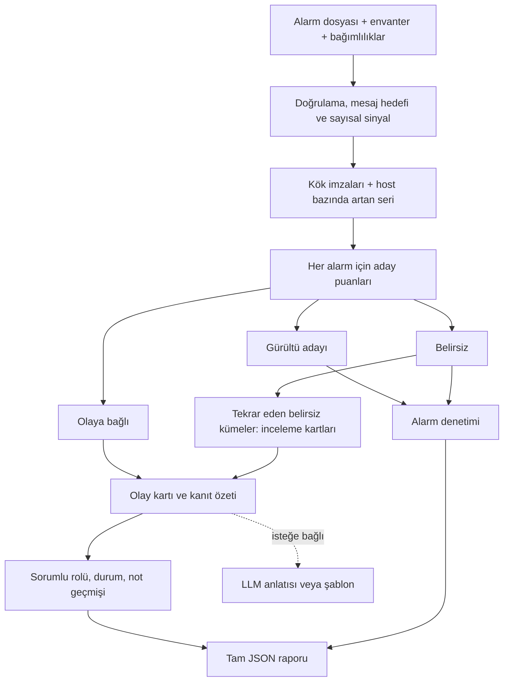

# Mimari

## Genel Bakış

Python standart kütüphanesiyle tek süreçli yerel uygulama. Başlangıçta analiz bir kez yapılır; tarayıcı raporu ve filtrelenmiş alarm sayfalarını okur. Aksiyonlar kilitle korunan bellekte güncellenir. Harici model kritik yolda değildir.

**Zaman penceresi alarm ataması değildir.** Bellek olayı ağ, depolama ve dış servis pencereleriyle çakışır. Her alarm kendi tipi, servisi, mesaj hedefi, host konumu ve yönlü grafik yolu üzerinden değerlendirilir. Yakın puanlı iki aday varsa kayıt belirsiz kalır.

## Bileşenler

| Bileşen | Sorumluluk | Teknoloji |
|---|---|---|
| `app.py` | CLI, `.env`, JSON dışa aktarım | argparse, pathlib, json |
| `src/engine.py` | Doğrulama, trend, grafik, karar ve gerekçe | csv, datetime, collections, statistics |
| `src/server.py` | Rapor, filtre, versiyonlu aksiyon | ThreadingHTTPServer, threading |
| `src/narrative.py` | Kanıt özeti, şema/kimlik kontrolü, fallback | urllib, json |
| `static/` | Olay → kanıt → aksiyon; denetim | HTML, CSS, vanilla JS, SVG |

## Veri Akışı

## Kararlar ve Gerekçeler

### Grafik ve fiziksel alan

`kaynak_servis → hedef_servis`, kaynağın hedefe bağımlılığıdır. Olası arıza etkisi ters yöndeki bağımlılarda aranır. Bağlantı nedensellik kanıtı değildir. `(veri_merkezi, kabin)` birlikte kullanılır. Senkron/asenkron alanı doğrulanır; MVP yol puanında iki tip aynı ağırlıktadır.

### Aday üretimi ve zaman

- Ağ: aynı fiziksel alanda `network_down/pkt_loss`; diğer aileler servis bazında disk, GC/OOM, dış erişim ve batch çakışması imzaları.
- Güçlü sinyaller arasında en çok 10 dakika; bellek için 30 dakika. Ağda en az 3, diğer ailelerde 2 güçlü sinyal. Tek güçlü kayıt belirsizdir.
- Kuyruklar son kök sinyaline göre: ağ 15, depolama 22, bellek 10, batch 30 dakika. Dış servis varsayılan 22 dakika, `--external-tail-minutes` / `EXTERNAL_TAIL_MINUTES` ile değişir. Tarih ve `03:01` sabitlenmez.
- Bellekte GC/OOM öncesi 75 dakika içinde host bazında artan yüzde zinciri: 30 sn–8 dk adım, en az 4 nokta, 10 dk süre ve 6 puan artış. Tipik artışın 2,5 katından büyük sıçrama zinciri böler. Aradaki rastgele düşük ölçümler öncül yapılmaz.
- Batch'te scheduler'a bağımlı ve aynı dönemde yavaşlayan en az iki işin ortak bağımlılığı kaynak baskısı adayıdır. Ters grafiği gelişigüzel yürümek yerine özel mekanizma açıkça uygulanır.

### Alarm seviyesinde korelasyon

Aday pencere ve uyumlu belirti ailesi zorunlu. Temel puan 3; aynı kök servisi +4 veya yönlü yol yakınlığı +2…4,4; ağda aynı fiziksel alan +5; batch ortak kaynağı/işi +3; grafikte doğrulanan mesaj hedefi +6; ilgisiz hedef −3. Özgül hata belirtisi +2; kök sinyal dönemiyle çakışma +1. Genel uyarıda en az 3 yerel tekrar aranır ve −1 uygulanır. Doğrudan kök imzaları ve kabul edilen bellek öncülleri 100 destek puanı alır.

En iyi puan **8** veya üstü, ikinciyle fark **en az 2** ise atama yapılır. Yakın rakipler belirsizdir. Kısmi destek **6** veya üstüyse gürültüye düşürülmez. Mesajda adı geçmesi eksik grafik kenarını gerçekmiş gibi oluşturmaz. Farklı tipler aynı olaya bağlanabilir; alarm ailesi aday uyumluluğunda da kullanılır, yalnız açıklama değildir.

`root.score` ek **destek özeti**: tip önceliği × erkenlik × şiddet × bağımlı derinliği. Aile güçlü imzadan gelir; bu skor tek başına kök seçmez. Güven etiketi kalibre olasılık değildir. Alternatifler kesin elenmiş nedenler olarak sunulmaz.

### Gürültü ve belirsiz inceleme

Yoğunlaşma `tepe / max(medyan,1)`; eşit 10 dakikalık dilimler kullanılır. Bakım/genel tip, düşük yoğunlaşma, severity ve olay bağlamının yokluğu birlikte değerlendirilir. Düşük oran tek başına eleme değildir.

Belirsizler aynı servis ve belirsizlik gerekçesiyle, en çok 5 dakikalık ardışık boşluklarla kümelenir. En az 8 alarm, 2 host ve 5 dakika gerekir. Rakip olay belirsizliği dışında en az 2 alarm tipi; hiç olay bağlantısı yoksa en az 4 yüksek şiddetli alarm da aranır. Bunlar açık heuristiklerdir. Sabit 2–4 kart zorunluluğu yoktur; bu veride 3 küme çıktı. Kayıtlar belirsiz kalır; çift sayılmaz.

### Kanıt ve sorumlu

Kartta gerçek alarm kimlikleri, zamanlar, doğrudan kök host'ları, bütün bellek öncülleri ve hedef/yol kanıtı bulunur. `conn_refused` hedefiyle hedefteki `network_down` birlikte gösterilir; doğrulanamayan yollar ayrılır. Bağlantı reddinden DNS çözümlemesinin kesin kesildiği çıkarılmaz.

| Kök ailesi | Başlangıç sorumlusu |
|---|---|
| Ağ | Ağ nöbetçisi |
| Depolama | DBA nöbetçisi |
| Dış servis | Entegrasyon nöbetçisi |
| Batch | Batch operasyon nöbetçisi |
| Bellek | Uygulama / JVM nöbetçisi |
| Çözülmemiş kök | Operasyon nöbetçisi |

Kritiklik yalnız önceliği etkiler; kişi veya ekip çıkarmaz. `db_conn_pool` paylaşılan belirtidir; depolama veya batch köküne göre sorumlu değişebilir. Sahip kullanıcı tarafından düzenlenebilir.

### Bütünleşik plandan uygulamaya netleşen noktalar

- Z-skoru tanısal olarak gösterilir; tek başına olay seçen eşik değildir. Güçlü imza + çok boyutlu atama esas alınır.
- Hareketli ortalama yerine host bazında artan alt seri kullanılır; araya giren rastgele ölçümlerle ilgili kullanıcı önerisi böyle karşılanır.
- “Elle eşik yok” denmez: eşikler açıktır, gizli etiketlere göre optimize edilmemiştir.
- Olay sayısı sabitlenmez. Olay ve inceleme toplamı 15'i aşarsa açık kabul hatası oluşur.
- Jüri ekranı önce kısa kanıt, servis etkisi ve aksiyon gösterir; ham kayıtlar ayrı denetim sekmesindedir. Örnek %94/%18 güven değerleri veriyle doğrulanmadığından kullanılmaz.

### Çalışma zamanı

127.0.0.1 sunucusu, statik dosya izin listesi, Host/Origin kontrolü, JSON boyut sınırı ve aksiyon sürümü. LLM yalnız düğmeyle çağrılır: HTTPS, 8 sn timeout, sınırlı yanıt, geçerli kanıt kimlikleri, cache. Model metninin anlamsal doğruluğu garanti edilmez; deterministik kanıt hep görünürdür. Anahtar tarayıcıya/hatalara dönmez.
